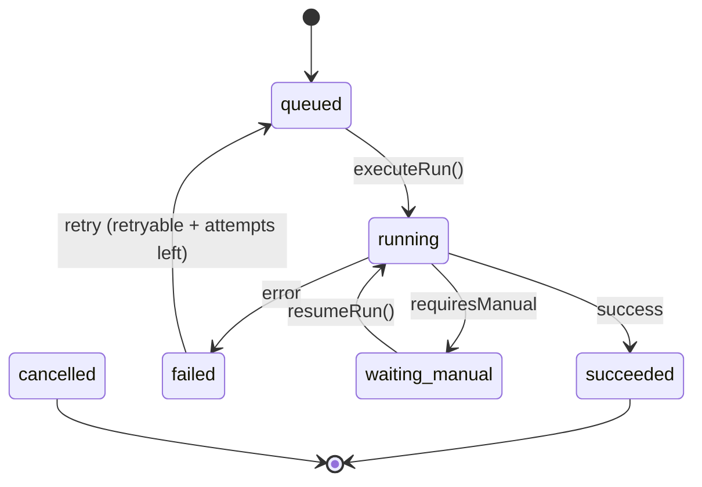

# Adapter Framework

> Sprint 2 — Adapter Framework & First Controlled Pilot

## Overview

The adapter framework provides a pluggable interface for integrating marketing platforms with the execution engine. Each adapter encapsulates platform-specific logic (API calls, authentication, status polling) behind a uniform contract, allowing the orchestrator to execute runs against any supported platform without modification.

The framework follows a **ports-and-adapters** (hexagonal) architecture:

- **Domain** defines the execution state machine and repository contract.
- **Adapters** implement the `PlatformAdapter` interface for each external platform.
- **Orchestrator** coordinates state transitions, checkpointing, and adapter invocation.

---

## Core Types

### `PlatformAdapter`

The primary contract that every adapter must implement.

```typescript
interface PlatformAdapter {
  execute(context: AdapterContext): Promise<AdapterResult>;
  checkStatus(runId: RunId): Promise<StatusCheckResult>;
}
```

| Method | Description |
| --- | --- |
| `execute(context)` | Performs the platform operation. Returns success/failure/manual requirements. |
| `checkStatus(runId)` | Queries the remote platform for the current state of a run. |

### `AdapterContext`

Immutable context passed to `adapter.execute()`. Contains only non-sensitive, domain-derived fields.

```typescript
interface AdapterContext {
  readonly runId: RunId;
  readonly brandId: string;
  readonly market: string;
  readonly platform: string;
  readonly operation: string;
  readonly payload: unknown;
  readonly idempotencyKey: IdempotencyKey;
}
```

**Security:** The context is validated at construction time by `adapterContextSchema`. Sensitive field names (token, secret, password, API key, etc.) are rejected by the `superRefine` validator.

**Factory:** `buildAdapterContext(record, payload?)` extracts non-sensitive fields from a `RunRecord` and builds the context.

### `AdapterResult`

The result returned by `adapter.execute()`.

```typescript
interface AdapterResult {
  readonly success: boolean;
  readonly output?: unknown;
  readonly error?: RunError;
  readonly requiresManual: boolean;
}
```

| Field | Description |
| --- | --- |
| `success` | `true` if the operation completed successfully. |
| `output` | Optional platform-specific output data. |
| `error` | Optional structured error (message, code, retryable flag). |
| `requiresManual` | `true` if the operation requires human intervention. |

**Resolution rules:**

| `success` | `requiresManual` | `error?.retryable` | Resulting state |
| --- | --- | --- | --- |
| `true` | `false` | — | `succeeded` |
| `false` | `true` | — | `waiting_manual` |
| `false` | `false` | `true` | `failed` (retryable) |
| `false` | `false` | `false` | `failed` (terminal) |

### `StatusCheckResult`

Returned by `adapter.checkStatus()` to report the remote platform's view of a run.

```typescript
interface StatusCheckResult {
  readonly state: RunState;
  readonly output?: unknown;
  readonly error?: RunError;
}
```

---

## Zod Schemas

All types are validated at runtime boundaries using Zod schemas:

| Schema | Type | Location |
| --- | --- | --- |
| `adapterContextSchema` | `AdapterContext` | `adapter-context.ts` |
| `adapterResultSchema` | `AdapterResult` | `platform-adapter.ts` |
| `statusCheckResultSchema` | `StatusCheckResult` | `platform-adapter.ts` |

Use `safeParse()` to validate at boundaries:

```typescript
const parsed = adapterResultSchema.safeParse(result);
if (!parsed.success) {
  throw new Error("Invalid adapter result");
}
```

---

## Execution Flow

The orchestrator (`orchestrator.ts`) coordinates the execution lifecycle:

```
executeRun(record, adapter, repo)
  1. transitionRunState(queued -> running)    // increments attempt
  2. createCheckpoint(record, {})              // audit trail
  3. repo.update(runningRecord)                // persist running state
  4. buildAdapterContext(record)               // build context
  5. adapter.execute(context)                  // call platform
  6. synchronizeStatus(adapter, runId, result) // reconcile with remote
  7. processResult(record, reconciled, raw)    // determine final state
  8. repo.update(finalRecord)                  // persist final state
```

### Status Synchronization

After `adapter.execute()`, the orchestrator calls `adapter.checkStatus()` via `synchronizeStatus()`. When the adapter's local result and the remote status disagree, the more conservative state wins:

```
Priority: failed (4) > waiting_manual (3) > running (2) > succeeded (1) > queued (0)
```

This ensures that if the remote platform reports a failure, the system transitions to `failed` even if the local result was `succeeded`.

---

## State Machine Integration

The adapter framework plugs into the domain state machine:



### Key Transitions

| Transition | Trigger | Side Effects |
| --- | --- | --- |
| `queued -> running` | `executeRun()` | Increments `attempt`, sets `startedAt` |
| `running -> succeeded` | `adapter.execute()` returns success | Sets `finishedAt` |
| `running -> failed` | `adapter.execute()` returns error | Sets `finishedAt`, attaches `error` |
| `running -> waiting_manual` | `adapter.execute()` returns `requiresManual` | No `finishedAt` (operation open) |
| `failed -> queued` | Recovery (retryable + attempts remaining) | Requires `error.retryable: true` |
| `waiting_manual -> running` | `resumeRun()` | Clears previous `error`, registers manual action metadata |

---

## File Structure

```
automation/adapters/
├── platform-adapter.ts       # PlatformAdapter, AdapterResult, StatusCheckResult
├── adapter-context.ts        # AdapterContext, buildAdapterContext
├── fake-adapter.ts           # FakeAdapter (testing)
├── orchestrator.ts           # executeRun, resumeRun
├── status-sync.ts            # synchronizeStatus, reconcile
├── in-memory-repo.ts         # InMemoryRunRepository (testing)
├── index.ts                  # Barrel exports
├── integration.test.ts       # Integration tests
├── recovery.test.ts          # Recovery & retry tests
├── e2e.test.ts               # End-to-end tests
├── platform-adapter.test.ts  # Unit tests
├── adapter-context.test.ts   # Unit tests
├── fake-adapter.test.ts      # Unit tests
└── orchestrator.test.ts      # Unit tests
```

---

## Conventions

- **No `any` types:** All interfaces are strongly typed.
- **Immutability:** Adapter methods receive and return readonly data.
- **Sensitive data rejection:** `adapterContextSchema` rejects fields with sensitive names.
- **Error redaction:** `redactError()` and `redactLog()` sanitize sensitive tokens from errors and logs.
- **Checkpointing:** Every `executeRun()` and `resumeRun()` creates a checkpoint before execution.
- **Deterministic testing:** `FakeAdapter` produces predictable outcomes for each mode.
