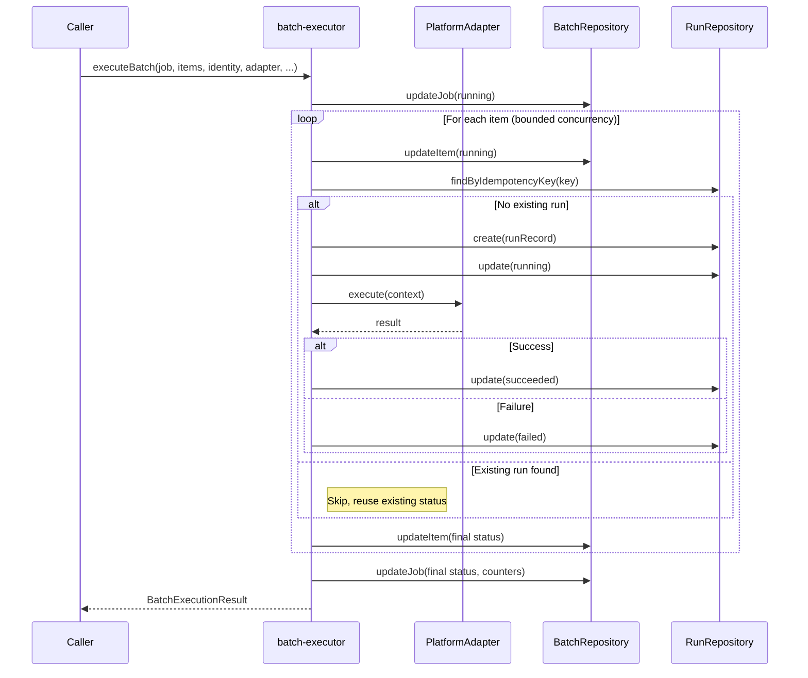

# Batch Processing

> Sprint 4 — Scheduling + Observability + Operational Hardening

## Overview

The batch processing subsystem enables execution of multiple related items as a single logical unit (`BatchJob`) with per-item isolation, partial failure semantics, and bounded concurrency. Each batch item creates an independent `RunRecord` with its own idempotency key, ensuring that individual item failures never corrupt or interrupt the batch.

The design follows the existing architecture principles:

- **Per-item isolation (AC-12):** A failing item never prevents other items from executing.
- **Idempotency preservation (AC-13):** Each item gets a deterministic idempotency key derived from `batchId + itemId + identity + payload`.
- **Partial failure semantics (AC-14):** A batch can succeed with some items failed (`partial_failure` status).
- **Batch-run correlation (AC-15):** `RunRecord.metadata.batchId` and `RunRecord.metadata.itemId` link runs back to their batch.

---

## Core Types

### `BatchId`

Branded string type representing a unique batch identifier. Generated via `createBatchId()` (UUID v4).

```typescript
type BatchId = string & { readonly __brand: "BatchId" };
```

### `BatchItemId`

Branded string type representing a unique batch item identifier. Generated via `createBatchItemId()` (UUID v4).

```typescript
type BatchItemId = string & { readonly __brand: "BatchItemId" };
```

### `BatchStatus`

```typescript
type BatchStatus = "pending" | "running" | "succeeded" | "partial_failure" | "failed" | "cancelled";
```

### `BatchItemStatus`

```typescript
type BatchItemStatus = "pending" | "running" | "succeeded" | "failed" | "cancelled";
```

### `BatchJob`

The batch container. Tracks overall progress via item counters.

```typescript
interface BatchJob {
  readonly schemaVersion: 1;
  readonly batchId: BatchId;
  readonly status: BatchStatus;
  readonly totalItems: number;
  readonly completedItems: number;
  readonly failedItems: number;
  readonly createdAt: Date;
  readonly updatedAt: Date;
  readonly metadata?: Record<string, unknown>;
}
```

### `BatchItem`

An individual unit of work within a batch. Each item is correlated to a `RunRecord` once execution begins.

```typescript
interface BatchItem {
  readonly schemaVersion: 1;
  readonly itemId: BatchItemId;
  readonly batchId: BatchId;
  readonly runId: string | null;   // null until run is created
  readonly status: BatchItemStatus;
  readonly error?: string;
  readonly createdAt: Date;
  readonly updatedAt: Date;
  readonly metadata?: Record<string, unknown>;
}
```

### `BatchExecutionResult`

Summary returned after batch execution completes.

```typescript
interface BatchExecutionResult {
  readonly batchId: BatchId;
  readonly totalItems: number;
  readonly completedItems: number;
  readonly failedItems: number;
  readonly status: "succeeded" | "partial_failure" | "failed";
  readonly errors: Array<{ itemId: string; error: string }>;
}
```

### `BatchExecutionOptions`

```typescript
interface BatchExecutionOptions {
  readonly concurrency?: number;   // default: 1, hard max: 5
  readonly maxAttempts?: number;   // default: 1
}
```

---

## Core Functions

### Batch Execution (`batch-executor.ts`)

| Function | Description |
| --- | --- |
| `executeBatch(job, items, identity, adapter, batchRepo, runRepo, clock, options?)` | Executes all items with bounded concurrency. |

**Execution flow:**

1. Validate concurrency (1–5). Reject values outside range.
2. Transition `BatchJob` to `running`.
3. For each item:
   a. Transition item to `running`.
   b. Compute deterministic idempotency key: `computeIdempotencyKey(identity, { batchId, itemId, ...payload })`.
   c. Check for existing run (idempotency). If exists, skip to step 3g.
   d. Create `RunRecord` with `metadata: { batchId, itemId, ...itemPayload }`.
   e. Transition run: `queued → running`.
   f. Execute via `adapter.execute(context)`. Transition to `succeeded` or `failed`.
   g. Update `BatchItem` with final status.
   h. On error: catch, redact, mark item as failed. **Never interrupt the batch.**
4. Determine final `BatchJob` status:
   - `failedItems === 0` → `succeeded`
   - `completedItems === 0` → `failed`
   - Otherwise → `partial_failure`
5. Update `BatchJob` with final counters.

### Concurrency Control

| Function | Description |
| --- | --- |
| `executeSequentially(items, executeItem)` | Default: one item at a time (concurrency=1). |
| `executeBounded(items, concurrency, executeItem)` | Bounded concurrent execution using a promise pool. |

**Hard limits:**

- `BATCH_DEFAULT_CONCURRENCY = 1` (sequential by default)
- `BATCH_HARD_MAX_CONCURRENCY = 5` (never exceed, even with configuration override)

### Idempotency Key Computation

```typescript
function computeBatchItemIdempotencyKey(
  batchId: BatchId,
  itemId: string,
  identity: RunIdentity,
  payload: unknown,
): IdempotencyKey {
  return computeIdempotencyKey(identity, { batchId, itemId, ...identity, payload });
}
```

This ensures:
- Same batch + same item + same payload → same key (idempotent retry)
- Different items in the same batch → different keys (per-item isolation)
- Same payload in different batches → different keys (batch isolation)

---

## Flow Diagram

```
┌─────────────────────────────────────────────────────────────┐
│                    Batch Execution                           │
│                                                             │
│  executeBatch(job, items, identity, adapter, repos)         │
│       │                                                     │
│       ├──► Validate concurrency (1-5)                       │
│       │                                                     │
│       ├──► Transition BatchJob → running                    │
│       │                                                     │
│       ├──► For each BatchItem:                              │
│       │       │                                             │
│       │       ├── Transition item → running                 │
│       │       │                                             │
│       │       ├── Compute idempotency key                   │
│       │       │     └── SHA-256(identity + batchId + itemId)│
│       │       │                                             │
│       │       ├── Check existing run (idempotency)          │
│       │       │     └── found? → skip, reuse status         │
│       │       │                                             │
│       │       ├── Create RunRecord                          │
│       │       │     └── metadata: { batchId, itemId, ... }  │
│       │       │                                             │
│       │       ├── Transition run: queued → running          │
│       │       │                                             │
│       │       ├── adapter.execute(context)                  │
│       │       │                                             │
│       │       ├── succeeded?                                │
│       │       │     ├── run → succeeded                     │
│       │       │     └── completedItems++                    │
│       │       │                                             │
│       │       ├── failed?                                   │
│       │       │     ├── run → failed                        │
│       │       │     ├── failedItems++                       │
│       │       │     └── errors.push(itemId, redacted error) │
│       │       │                                             │
│       │       └── Update BatchItem status                   │
│       │                                                     │
│       ├──► Compute final BatchJob status                    │
│       │     ├── 0 failures → succeeded                     │
│       │     ├── 0 successes → failed                       │
│       │     └── mixed → partial_failure                    │
│       │                                                     │
│       └──► Return BatchExecutionResult                      │
│                                                             │
└─────────────────────────────────────────────────────────────┘
```

### Sequence Diagram



---

## Security Invariants

| ID | Invariant | Implementation |
| --- | --- | --- |
| SEC-01 | Per-item isolation | Each item creates an independent `RunRecord`; item failure is caught and never propagates to abort the batch |
| SEC-02 | Idempotency preserved | Deterministic key per item prevents duplicate execution on retry |
| SEC-03 | Partial failure semantics | Final status reflects actual outcomes: `succeeded`, `partial_failure`, or `failed` |
| SEC-04 | Error redaction | `redactError()` and `redactErrorString()` applied to all error messages before storage |
| SEC-05 | Concurrency hard limit | `BATCH_HARD_MAX_CONCURRENCY = 5` enforced at validation; throws on violation |
| SEC-06 | No unsafe type assertions | Item arrays validated with `Array.isArray()`; concurrency validated with `typeof` check |
| SEC-07 | Batch-run correlation | `RunRecord.metadata.batchId` and `itemId` link runs to their batch for traceability |
| SEC-08 | No secrets in batch items | Payload is stored in `BatchItem.metadata.payload`; credential injection happens only at adapter execution |
| SEC-09 | Empty batch rejected | Scheduler rejects batches with zero items to prevent noise |
| SEC-10 | Overlap prevention for batches | Scheduler checks for active (running + pending) batches with same `scheduleId` before creating new ones |

---

## Related Tests

| Test File | AC Coverage | Description |
| --- | --- | --- |
| `batch-schema.test.ts` | AC-11 to AC-13 | Schema validation, factory functions, branded types |
| `batch-executor.test.ts` | AC-12 to AC-16 | Per-item isolation, idempotency, partial failure, concurrency bounds |
| `scheduler-engine.test.ts` | AC-16 | Batch mode integration with scheduler |
| `sprint4-integration.test.ts` | AC-17 | End-to-end batch execution with file persistence |

---

## File Structure

```
automation/domain/
├── batch-schema.ts           # BatchId, BatchJob, BatchItem, Zod schemas
├── batch-schema.test.ts
├── batch-repository.ts       # BatchRepository interface
├── batch-repository.test.ts
├── batch-executor.ts         # executeBatch, concurrency control
└── batch-executor.test.ts

automation/adapters/
└── (adapters implement BatchRepository interface)
```

---

## Conventions

- **Sequential by default:** `concurrency=1` unless explicitly overridden. Bounded execution prevents resource exhaustion.
- **Hard maximum:** `BATCH_HARD_MAX_CONCURRENCY = 5` is a compile-time constant, not configurable at runtime.
- **No batch abort on item failure:** The executor catches item errors and continues. The batch always completes.
- **Zod at boundaries:** `batchJobSchema` and `batchItemSchema` validate all data entering or leaving the domain.
- **Immutable records:** `BatchJob` and `BatchItem` are never mutated; updates return new objects.
