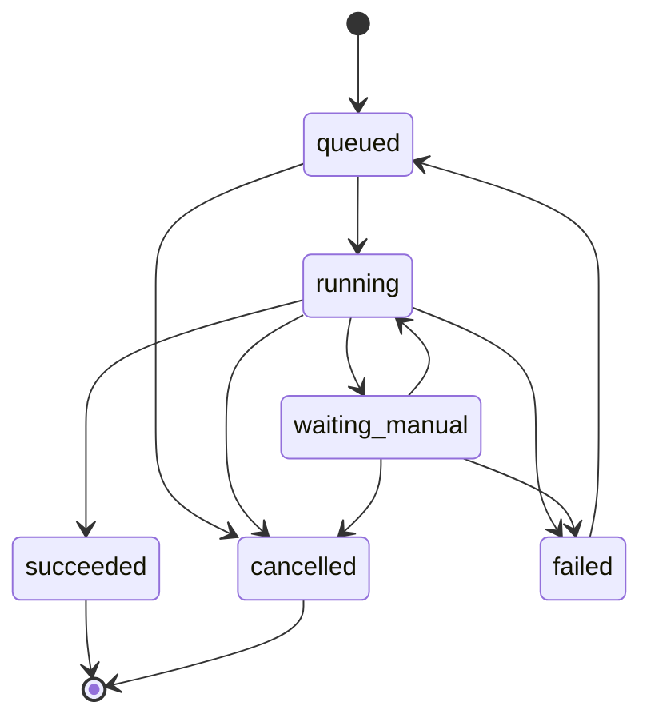

# Domain Layer — Execution Engine

> Sprint 1 — Execution domain & idempotency

## Overview

The domain layer encapsulates the core execution logic for marketing operations automation. It is technology-agnostic: no database drivers, HTTP clients, or framework dependencies are allowed. All state transitions, idempotency checks, error handling, and checkpointing are defined here as pure domain functions.

The layer follows a **functional-core, imperative-shell** architecture:

- **Types and interfaces** define the contract (`RunRecord`, `RunRepository`, `Checkpoint`).
- **Pure functions** compute state transitions (`transitionRunState`, `createCheckpoint`).
- **Adapters** (outside this layer) handle persistence, HTTP, and external services.

---

## Core Types

### `RunId`

Branded string type representing a unique run identifier. Generated via `createRunId()` (UUID v4).

```typescript
type RunId = string & { readonly __brand: "RunId" };
```

### `IdempotencyKey`

Branded string type (SHA-256 hex) derived from a `RunIdentity` + payload combination. Ensures that identical requests produce the same key.

```typescript
type IdempotencyKey = string & { readonly __brand: "IdempotencyKey" };
```

### `PayloadFingerprint`

Branded string type (SHA-256 hex) of a canonicalized payload. Used to detect payload changes between retries.

```typescript
type PayloadFingerprint = string & { readonly __brand: "PayloadFingerprint" };
```

### `RunIdentity`

Describes the logical identity of a run. Used to compute idempotency keys.

```typescript
interface RunIdentity {
  readonly brandId: string;
  readonly market: string;
  readonly platform: string;
  readonly operation: string;
}
```

### `RunState`

Finite state machine states for a run record.

```typescript
type RunState =
  | "queued"
  | "running"
  | "waiting_manual"
  | "succeeded"
  | "failed"
  | "cancelled";
```

### `RunError`

Structured error attached to a run record on failure.

```typescript
interface RunError {
  message: string;
  code?: string;
  retryable?: boolean;
}
```

### `RunRecord`

The central domain entity. Represents a single execution of a marketing operation.

```typescript
interface RunRecord {
  schemaVersion: number;
  runId: RunId;
  brandId: string;
  market: string;
  platform: string;
  operation: string;
  state: RunState;
  attempt: number;
  maxAttempts: number;
  idempotencyKey: IdempotencyKey;
  payloadFingerprint: PayloadFingerprint;
  createdAt: Date;
  updatedAt: Date;
  startedAt?: Date;
  finishedAt?: Date;
  error?: RunError;
  metadata?: Record<string, unknown>;
}
```

Validated at runtime with `runRecordSchema` (Zod).

### `Checkpoint`

A serializable snapshot of a run's state at a point in time. Used for persistence and recovery.

```typescript
interface Checkpoint {
  readonly runId: RunId;
  readonly state: RunState;
  readonly attempt: number;
  readonly payload: Record<string, unknown>;
  readonly createdAt: Date;
}
```

---

## Core Functions

### Identity & Idempotency (`idempotency.ts`)

| Function | Description |
| --- | --- |
| `createRunId()` | Generates a new UUID v4 `RunId`. |
| `fingerprintPayload(payload)` | Canonicalizes `payload` and returns a SHA-256 `PayloadFingerprint`. Rejects sensitive fields, circular references, non-JSON values. |
| `computeIdempotencyKey(identity, payload)` | Derives a deterministic `IdempotencyKey` from `RunIdentity` + canonical payload. |

**Canonicalization rules:**

- Object keys are sorted alphabetically.
- Sensitive field names (token, secret, password, etc.) are rejected.
- JWT, PEM, Bearer, and session patterns in values are rejected.
- Circular references, sparse arrays, non-plain objects, and non-finite numbers throw.

### State Transitions (`transition.ts`)

| Function | Description |
| --- | --- |
| `transitionRunState(context)` | Applies a valid state transition and returns a new `RunRecord`. |

**Transition matrix:**

| From | Allowed targets |
| --- | --- |
| `queued` | `running`, `cancelled` |
| `running` | `waiting_manual`, `succeeded`, `failed`, `cancelled` |
| `waiting_manual` | `running`, `failed`, `cancelled` |
| `failed` | `queued` (only if retryable + attempts remaining) |
| `succeeded` | _(none — terminal)_ |
| `cancelled` | _(none — terminal)_ |

**Retry rules:**

- `failed → queued` is allowed only when:
  - The error has `retryable: true`, AND
  - `attempt < maxAttempts`
- On `queued → running`, `attempt` increments by 1.
- Attempt increment throws if it would exceed `maxAttempts`.

**Side effects on transition:**

- `queued → running`: sets `startedAt`, increments `attempt`.
- `→ succeeded | failed | cancelled`: sets `finishedAt`.
- `→ failed` with error: attaches `error` to record.
- `waiting_manual → running`: clears `error`.

### Error & Log Redaction (`redaction.ts`)

| Function | Description |
| --- | --- |
| `redactError(error)` | Returns a new `RunError` with sensitive tokens replaced by `[REDACTED]`. |
| `redactLog(entry)` | Returns a new log entry with all sensitive string values redacted. |

**Patterns redacted:**

- JWT tokens (`eyJ...`)
- API keys (`sk_live_*`, `sk_test_*`, `ak_*`)
- Password/secret assignments (`password=...`, `token=...`)
- Session IDs (`session_id=...`, `sid=...`)
- Bearer tokens (`Bearer ...`)
- PEM certificates (`-----BEGIN ...-----`)

### Checkpointing (`checkpoint.ts`)

| Function | Description |
| --- | --- |
| `createCheckpoint(record, payload)` | Creates a `Checkpoint` snapshot from a `RunRecord` and arbitrary serializable payload. |

---

## Repository Interface (`repository.ts`)

The `RunRepository` interface defines the persistence contract. It is technology-agnostic — concrete adapters (SQL Server, SQLite, in-memory) implement it.

```typescript
interface RunRepository {
  create(record: RunRecord): Promise<RunRecord>;
  getById(runId: RunId): Promise<RunRecord | null>;
  update(record: RunRecord): Promise<RunRecord>;
  list(filters?: RunListFilters): Promise<RunRecord[]>;
  findByIdempotencyKey(key: IdempotencyKey): Promise<RunRecord | null>;
}
```

### `RunListFilters`

```typescript
interface RunListFilters {
  readonly brandId?: string;
  readonly market?: string;
  readonly platform?: string;
  readonly operation?: string;
  readonly state?: RunState;
}
```

### Usage Guide

1. **Create a run:** Generate `RunId`, compute `IdempotencyKey` and `PayloadFingerprint`, build `RunRecord`, call `repo.create()`.
2. **Start execution:** Call `transitionRunState({ current, targetState: "running" })`, then `repo.update()`.
3. **Complete:** Transition to `succeeded` or `failed`, then `repo.update()`.
4. **Retry on failure:** If error is retryable and attempts remain, transition `failed → queued`, then `queued → running`.
5. **Manual intervention:** Transition to `waiting_manual`. When approved, transition back to `running`.
6. **Checkpointing:** Call `createCheckpoint(record, payload)` to snapshot state for persistence.
7. **Idempotency:** Before creating a run, check `repo.findByIdempotencyKey()` to prevent duplicates.

---

## State Diagram



**Notes:**

- `failed → queued` is only allowed when the error is retryable AND `attempt < maxAttempts`.
- `succeeded` and `cancelled` are terminal — no further transitions are allowed.

---

## File Structure

```
automation/domain/
├── idempotency.ts          # RunId, IdempotencyKey, PayloadFingerprint
├── idempotency.test.ts
├── run-state.ts            # RunState, RunError, INITIAL_STATE
├── run-record.ts           # RunRecord, runRecordSchema (Zod)
├── run-record.test.ts
├── transition.ts           # transitionRunState()
├── transition.test.ts
├── redaction.ts            # redactError(), redactLog()
├── redaction.test.ts
├── repository.ts           # RunRepository interface
├── repository.test.ts
├── checkpoint.ts           # Checkpoint, createCheckpoint()
├── checkpoint.test.ts
├── integration.test.ts     # Full lifecycle integration tests
└── index.ts                # Public API barrel exports
```

---

## Conventions

- **Strict TypeScript:** No `any` types. All branded types prevent accidental misuse.
- **Immutability:** Functions return new objects; originals are never mutated.
- **Zod validation:** `runRecordSchema` validates `RunRecord` at runtime boundaries.
- **No side effects in domain functions:** All I/O is deferred to adapters.
- **Prettier formatting:** Semi, trailing commas, double quotes, 100 char width.
