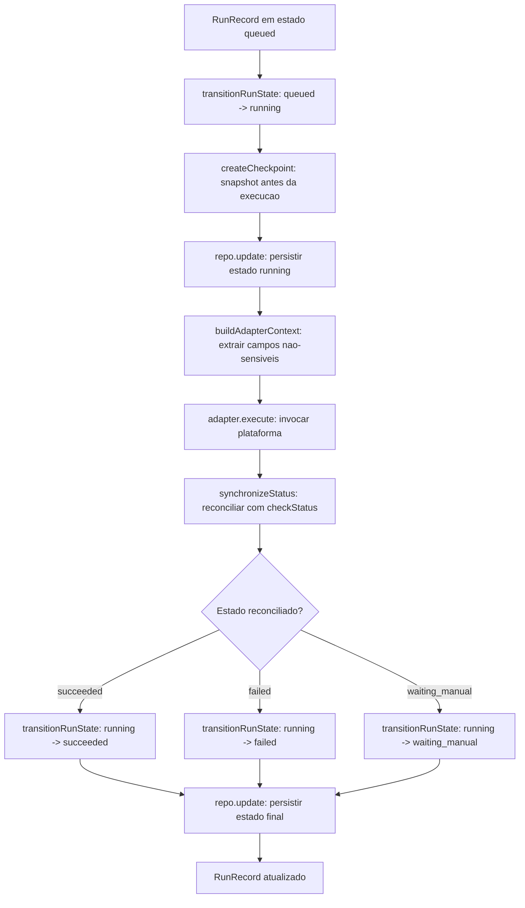
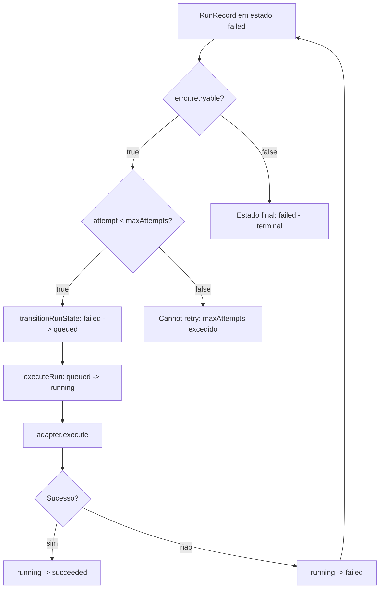
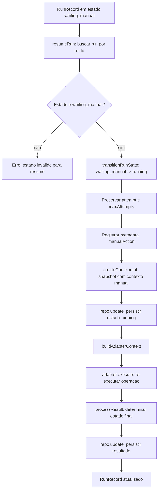
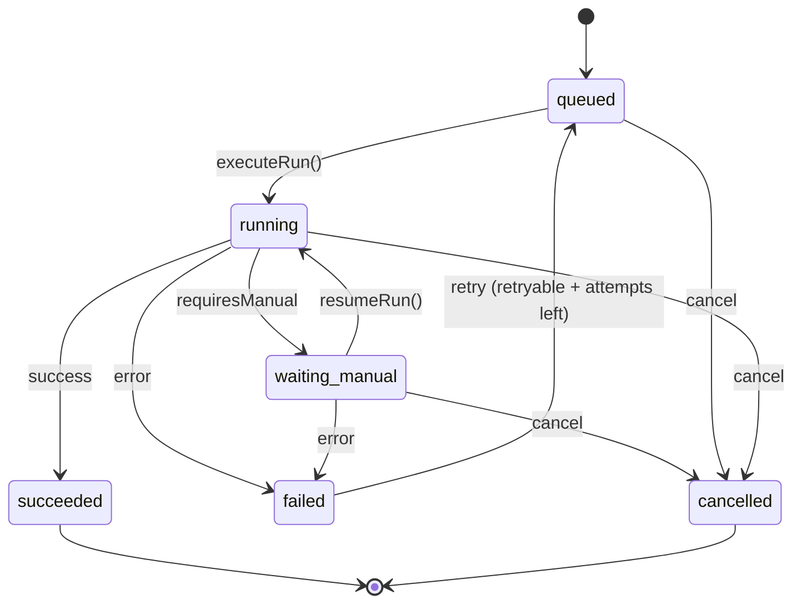
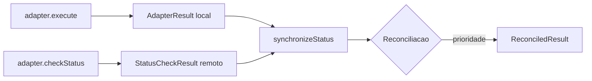

# Execution Flow

> Diagrama de fluxo de execucao com adapter — Sprint 2

## Visao Geral

O fluxo de execucao coordena a transicao de estados de um `RunRecord` atraves do orquestrador, que invoca o `PlatformAdapter` e sincroniza o resultado com o estado remoto.

---

## Fluxo Principal: executeRun()



---

## Fluxo de Retry



---

## Fluxo de Resume (waiting_manual)



---

## Transicoes de Estado



### Regras de Transicao

| De | Para | Condicoes | Efeitos Colaterais |
| --- | --- | --- | --- |
| `queued` | `running` | Sempre (via executeRun) | `attempt++`, `startedAt = now` |
| `queued` | `cancelled` | Solicitacao externa | `finishedAt = now` |
| `running` | `succeeded` | `adapter.execute().success === true` | `finishedAt = now` |
| `running` | `failed` | `adapter.execute().success === false` | `finishedAt = now`, `error` anexado |
| `running` | `waiting_manual` | `adapter.execute().requiresManual === true` | Sem `finishedAt` (operacao aberta) |
| `running` | `cancelled` | Solicitacao externa | `finishedAt = now` |
| `failed` | `queued` | `error.retryable === true` E `attempt < maxAttempts` | Nenhum |
| `waiting_manual` | `running` | `resumeRun()` invocado | `error` limpo, metadata de acao manual |
| `waiting_manual` | `failed` | Erro durante resume | `finishedAt = now` |
| `waiting_manual` | `cancelled` | Solicitacao externa | `finishedAt = now` |
| `succeeded` | — | Terminal | Nenhuma transicao permitida |
| `cancelled` | — | Terminal | Nenhuma transicao permitida |

---

## Pontos de Checkpoint

Checkpoints sao criados em dois pontos criticos:

1. **Antes da execucao** (`executeRun`): Captura o estado `running` antes de invocar o adapter.
2. **Durante resume** (`resumeRun`): Captura o estado `running` com contexto da acao manual.

```typescript
// executeRun - checkpoint antes da execucao
createCheckpoint(runningRecord, {});

// resumeRun - checkpoint com contexto manual
createCheckpoint(persistedRunning, {
  actionType: "manual_resume",
  previousState: "waiting_manual",
  resumedAt: metadata.manualAction.resumedAt,
});
```

### Estrutura do Checkpoint

```typescript
interface Checkpoint {
  readonly runId: RunId;
  readonly state: RunState;
  readonly attempt: number;
  readonly payload: Record<string, unknown>;
  readonly createdAt: Date;
}
```

---

## Sincronizacao de Status

Apos `adapter.execute()`, o orquestrador reconcilia o resultado local com o estado remoto:



### Regra de Prioridade

```
failed (4) > waiting_manual (3) > running (2) > succeeded (1) > queued (0)
```

Quando ha conflito entre o resultado local e o remoto, o estado com maior prioridade vence.

---

## Seguranca e Redacao

### Rejeicao de Campos Sensiveis

O `adapterContextSchema` rejeita campos com nomes sensiveis:

```
token, secret, password, api_key, authorization, credential,
private_key, client_secret, access_key, session_id, cookie, etc.
```

### Redacao de Erros e Logs

`redactError()` e `redactLog()` substituem padroes sensiveis por `[REDACTED]`:

- JWT tokens (`eyJ...`)
- API keys (`sk_live_*`, `sk_test_*`, `ak_*`)
- Password/secret assignments (`password=...`, `token=...`)
- Session IDs (`session_id=...`, `sid=...`)
- Bearer tokens (`Bearer ...`)
- PEM certificates (`-----BEGIN ...-----`)

---

## Referencia

- `automation/adapters/orchestrator.ts` — Logica de execucao
- `automation/adapters/status-sync.ts` — Sincronizacao de status
- `automation/adapters/adapter-context.ts` — Construcao de contexto
- `automation/adapters/platform-adapter.ts` — Contrato do adapter
- `automation/domain/transition.ts` — Maquina de estados
- `automation/domain/checkpoint.ts` — Checkpointing
- `automation/domain/redaction.ts` — Redacao de dados sensiveis
