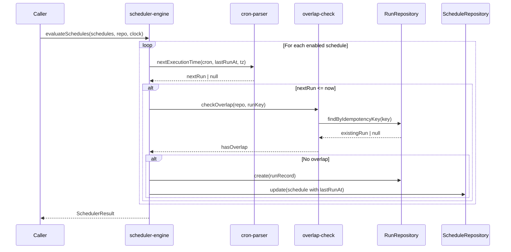

# Cron Scheduler

> Sprint 4 — Scheduling + Observability + Operational Hardening

## Overview

The scheduler subsystem enables automated, time-based execution of marketing operations using cron expressions with full IANA timezone support. It evaluates enabled schedules at regular intervals, creates `RunRecord` entries for due schedules, and integrates with the overlap prevention and batch processing subsystems.

The design follows the existing architecture principles:

- **Domain-agnostic:** `ScheduleRepository`, `ScheduleRecord`, and `ScheduleConfig` are defined in the domain layer.
- **Deterministic time:** All time calculations use the `Clock` interface for testability.
- **Idempotency-first:** Each schedule execution produces a deterministic idempotency key derived from the schedule config + execution timestamp (minute granularity).
- **Overlap prevention:** Active runs with the same idempotency key are detected before creating new runs.

---

## Core Types

### `ScheduleId`

Branded string type representing a unique schedule identifier. Generated via `createScheduleId()` (UUID v4).

```typescript
type ScheduleId = string & { readonly __brand: "ScheduleId" };
```

### `ScheduleConfig`

Configuration for an automated schedule. Validated at runtime with `scheduleConfigSchema` (Zod).

```typescript
interface ScheduleConfig {
  readonly cron: string;           // 5-field or alias (@daily, @hourly, etc.)
  readonly timezone: string;       // IANA timezone (e.g., "Europe/Lisbon")
  readonly brandId: string;
  readonly market: string;
  readonly platform: string;
  readonly operation: string;
  readonly enabled: boolean;
  readonly mode: "single" | "batch";
  readonly metadata?: Record<string, unknown>;
}
```

### `ScheduleRecord`

Persisted schedule state with tracking fields.

```typescript
interface ScheduleRecord {
  readonly schemaVersion: 1;
  readonly scheduleId: ScheduleId;
  readonly idempotencyKey: string;
  readonly config: ScheduleConfig;
  readonly createdAt: Date;
  readonly updatedAt: Date;
  readonly lastRunAt?: Date;
  readonly nextRunAt?: Date;
  readonly enabled: boolean;
  readonly revision: number;       // Optimistic concurrency
}
```

### `ParsedCron`

Expanded cron expression with sets of valid values per field.

```typescript
interface ParsedCron {
  readonly minutes: Set<number>;       // 0-59
  readonly hours: Set<number>;         // 0-23
  readonly daysOfMonth: Set<number>;   // 1-31
  readonly months: Set<number>;        // 1-12
  readonly daysOfWeek: Set<number>;    // 0-6 (0=Sunday)
  readonly raw: string;
}
```

### `SchedulerResult`

Summary returned after evaluating all schedules.

```typescript
interface SchedulerResult {
  evaluated: number;
  due: number;
  executed: number;
  skippedOverlap: number;
  skippedConcurrency: number;
  errors: Array<{ scheduleId: string; error: string }>;
}
```

---

## Core Functions

### Cron Parsing (`cron-parser.ts`)

| Function | Description |
| --- | --- |
| `parseCronExpression(expr)` | Parses a 5-field cron expression or alias into a `ParsedCron` object. |
| `nextExecutionTime(cron, from, tz)` | Calculates the next execution time using intelligent skipping (O(1) for typical expressions). |
| `matchesCron(cron, date, tz)` | Checks if a `Date` matches a parsed cron expression. |

**Supported tokens:**

- Wildcard: `*`
- Ranges: `1-5`
- Steps: `*/2`, `1-5/2`
- Lists: `1,3,5`
- Aliases: `@hourly`, `@daily`, `@weekly`, `@monthly`, `@yearly`

**Intelligent skipping algorithm:**

Instead of iterating minute-by-minute, `nextExecutionTime` jumps directly to the next valid value at each granularity level (minute → hour → day → month → year). This makes typical expressions resolve in O(1) iterations.

### Schedule Evaluation (`scheduler-engine.ts`)

| Function | Description |
| --- | --- |
| `evaluateSchedules(schedules, repo, clock, scheduleRepo?, batchDeps?)` | Evaluates all enabled schedules and creates runs for due ones. |

**Evaluation flow:**

1. Filter enabled schedules.
2. For each schedule, compute next execution time from `lastRunAt` (or `createdAt`).
3. If next execution ≤ now, mark as due.
4. Compute run-level idempotency key: `SHA-256(scheduleKey:YYYY-MM-DDTHH:MM)`.
5. Check overlap via `checkOverlap()`.
6. Check concurrency limit (`MAX_CONCURRENT_BATCH = 5`).
7. Create `RunRecord` (single mode) or `BatchJob` (batch mode).
8. Update `lastRunAt` on the schedule.

### Timezone Utilities (`timezone.ts`)

| Function | Description |
| --- | --- |
| `getTzComponents(date, tz)` | Extracts year/month/day/hour/minute/second in a timezone. |
| `buildEpochFromTzComponents(components, tz)` | Constructs a `Date` from timezone-aware components, handling DST gaps and ambiguities. |
| `isValidTimezone(tz)` | Validates an IANA timezone string. |

---

## Flow Diagram

```
┌─────────────────────────────────────────────────────────┐
│                    Scheduler Tick                        │
│                                                         │
│  evaluateSchedules(schedules, repo, clock)              │
│       │                                                 │
│       ├──► Filter enabled schedules                     │
│       │                                                 │
│       ├──► For each schedule:                           │
│       │       │                                         │
│       │       ├── computeNextDueTime(schedule)           │
│       │       │     └── nextExecutionTime(cron, ref, tz) │
│       │       │                                         │
│       │       ├── nextRun > now? → skip (not due)       │
│       │       │                                         │
│       │       ├── computeRunIdempotencyKey()             │
│       │       │     └── SHA-256(scheduleKey:minute)      │
│       │       │                                         │
│       │       ├── checkOverlap(repo, runKey)             │
│       │       │     └── exists active run? → skip        │
│       │       │                                         │
│       │       ├── batch mode?                            │
│       │       │     ├── check active batches             │
│       │       │     ├── createBatchJob()                 │
│       │       │     ├── createBatchItems()               │
│       │       │     └── executeBatch()                   │
│       │       │                                         │
│       │       ├── single mode?                           │
│       │       │     ├── create RunRecord                 │
│       │       │     └── repo.create(run)                 │
│       │       │                                         │
│       │       └── update schedule.lastRunAt              │
│       │                                                 │
│       └──► Return SchedulerResult                       │
│                                                         │
└─────────────────────────────────────────────────────────┘
```

### Sequence Diagram



---

## Security Invariants

| ID | Invariant | Implementation |
| --- | --- | --- |
| SEC-01 | No secrets in schedule config | `ScheduleConfig.metadata` is a plain record; credential injection happens only at adapter execution time via `access-preflight-gate` |
| SEC-02 | Cron expression validated | `cronExpressionSchema` (Zod) rejects malformed expressions before persistence |
| SEC-03 | Timezone validated | `timezoneSchema` uses `Intl.DateTimeFormat` to verify IANA validity |
| SEC-04 | Idempotency prevents duplicate runs | `computeRunIdempotencyKey` is deterministic: same schedule + same minute = same key |
| SEC-05 | Overlap prevention | `checkOverlap()` returns `true` (fail-closed) on error; prevents concurrent runs with same key |
| SEC-06 | Error messages redacted | `redactErrorString()` applied to all error messages in `SchedulerResult.errors` |
| SEC-07 | Concurrency bounded | `MAX_CONCURRENT_BATCH = 5` limits concurrent run creation per tick |
| SEC-08 | Path traversal protection | File-based schedule repository uses `safeResolve()` |
| SEC-09 | Optimistic concurrency | `ScheduleRecord.revision` prevents lost updates in concurrent write scenarios |
| SEC-10 | No auto-execution of disabled schedules | `evaluateSchedules` filters `enabled === true` before evaluation |

---

## Related Tests

| Test File | AC Coverage | Description |
| --- | --- | --- |
| `cron-parser.test.ts` | AC-01 to AC-05 | Parsing, alias expansion, DST handling, impossible expressions |
| `schedule-schema.test.ts` | AC-06 to AC-08 | Zod validation, idempotency key computation |
| `schedule-repository.test.ts` | AC-09 to AC-10 | CRUD, optimistic concurrency, listing with filters |
| `scheduler-engine.test.ts` | AC-11 to AC-16 | Evaluation, overlap, concurrency limit, batch mode integration |
| `timezone.test.ts` | AC-17 to AC-18 | DST gaps, DST ambiguities, offset calculation |
| `overlap-check.test.ts` | AC-19 | Fail-closed behavior, active state detection |

---

## File Structure

```
automation/domain/
├── schedule-schema.ts        # ScheduleConfig, ScheduleRecord, Zod schemas
├── schedule-schema.test.ts
├── schedule-repository.ts    # ScheduleRepository interface
├── schedule-repository.test.ts
├── cron-parser.ts            # parseCronExpression, nextExecutionTime
├── cron-parser.test.ts
├── timezone.ts               # getTzComponents, buildEpochFromTzComponents
├── timezone.test.ts
├── scheduler-engine.ts       # evaluateSchedules, SchedulerResult
├── scheduler-engine.test.ts
├── overlap-check.ts          # checkOverlap (fail-closed)
└── overlap-check.test.ts

automation/adapters/
├── file-schedule-repo.ts     # FileScheduleRepository implementation
└── file-schedule-repo.test.ts
```

---

## Conventions

- **Deterministic time:** All time calculations use the `Clock` interface, never `Date.now()` directly.
- **Minute granularity:** Idempotency keys are computed at minute granularity to prevent duplicate runs within the same execution window.
- **Fail-closed overlap:** `checkOverlap()` returns `true` on any error, preventing accidental duplicate execution.
- **Zod at boundaries:** `scheduleConfigSchema` and `scheduleRecordSchema` validate all data entering or leaving the domain.
- **Immutable schedule updates:** `ScheduleRecord` is never mutated; `update()` returns a new object with incremented `revision`.
