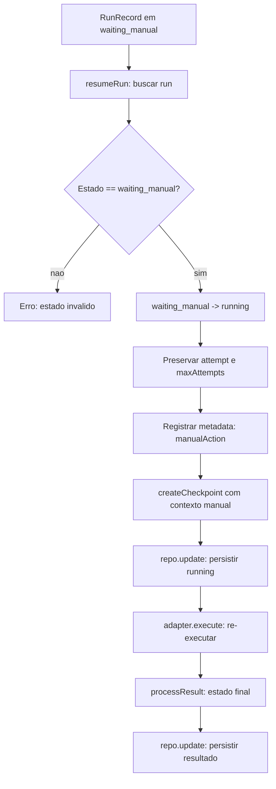
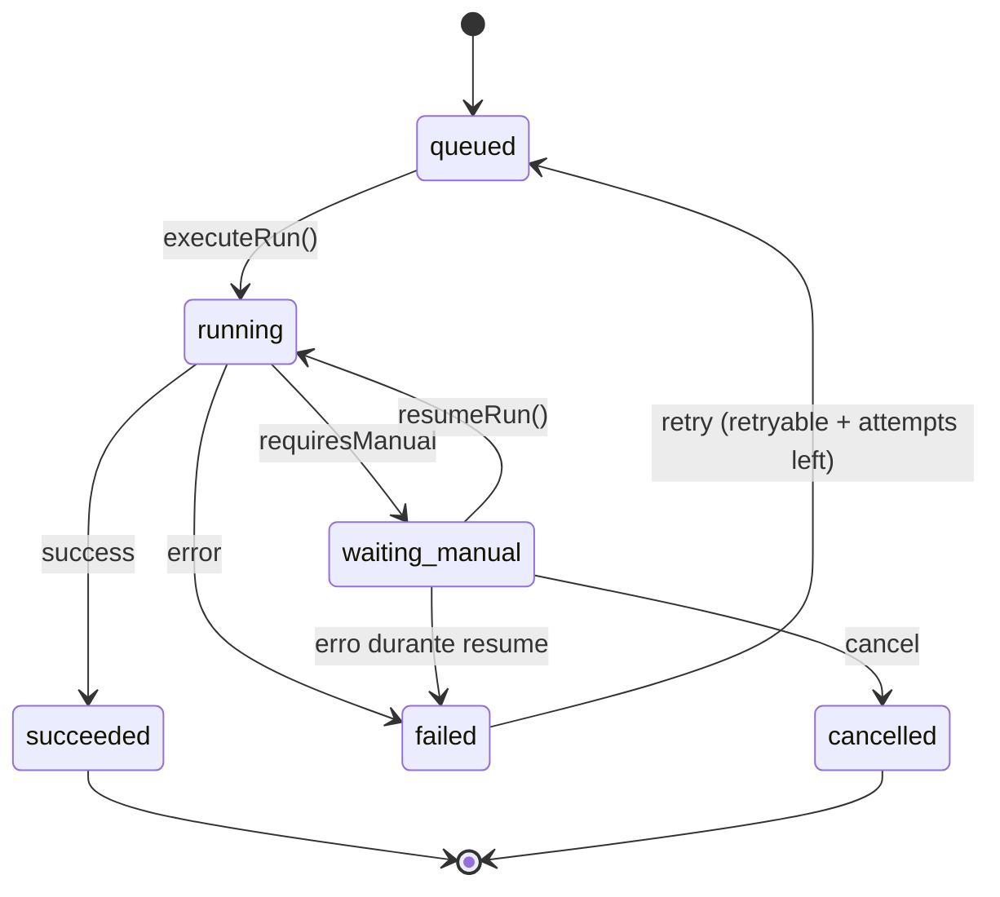

# Waiting Manual & Resume Flow Reference

> Documentacao de `waiting_manual` e fluxo de retomada — Ciclo 5

## Visao Geral

O estado `waiting_manual` representa uma run que requer intervencao humana antes de prosseguir. Quando um adapter retorna `requiresManual: true`, a run transita de `running` para `waiting_manual` e fica suspensa ate que um operador execute `resumeRun()`.

---

## O que e `waiting_manual`

`waiting_manual` e um dos seis estados possiveis de um `RunRecord`:

```typescript
type RunState =
  | "queued"
  | "running"
  | "waiting_manual"   // ← estado de suspensao para intervencao humana
  | "succeeded"
  | "failed"
  | "cancelled";
```

Diferente de `failed`, `waiting_manual` **nao define `finishedAt`** — a operacao permanece aberta. A run nao esta concluida, esta aguardando acao externa.

---

## Quando um Adapter Entra em `waiting_manual`

Um adapter entra em `waiting_manual` quando retorna:

```typescript
{
  success: false,
  requiresManual: true
}
```

### Exemplo: FakeAdapter (modo manual)

```typescript
const adapter = new FakeAdapter("manual");
const result = await adapter.execute(context);
// result = { success: false, requiresManual: true }
```

### Casos de Uso Reais

| Cenario | Descricao |
| --- | --- |
| Aprovacao pendente | Operacao requer aprovacao de um gestor antes de prosseguir |
| Verificacao manual | Plataforma exige verificacao manual de identidade ou documento |
| Limite atingido | API retornou erro indicando limite que so resolve com intervencao humana |
| Dados incompletos | Payload insuficiente e necessario input adicional do operador |
| CAPTCHA/verificacao | Plataforma exige resolucao de CAPTCHA ou verificacao similar |

---

## Fluxo de Retomada com `resumeRun()`

### Passo a Passo

```
1. Buscar run por runId (repo.getById)
2. Verificar estado == waiting_manual (senao, erro)
3. Transicao waiting_manual -> running (limpa error anterior)
4. Preservar attempt e maxAttempts (nao incrementa)
5. Registrar metadata: manualAction
6. Criar checkpoint com contexto manual
7. Persistir estado running (repo.update)
8. Construir AdapterContext (buildAdapterContext)
9. Chamar adapter.execute(context)
10. Processar resultado -> estado final
11. Persistir resultado final (repo.update)
```

### Codigo-fonte

```typescript
export async function resumeRun(
  runId: RunId,
  adapter: PlatformAdapter,
  repo: RunRepository,
): Promise<RunRecord> {
  // 1. Buscar run
  const record = await repo.getById(runId);

  if (!record) {
    throw new Error(`Run not found: ${runId}`);
  }

  // 2. Verificar estado
  if (record.state !== "waiting_manual") {
    throw new Error(`Cannot resume run in state "${record.state}": expected "waiting_manual"`);
  }

  // 3. Transicao waiting_manual -> running
  const runningRecord = transitionRunState({
    current: record,
    targetState: "running",
  });

  // 4. Preservar attempt e maxAttempts
  const runningWithAttempt = {
    ...runningRecord,
    attempt: record.attempt,
    maxAttempts: record.maxAttempts,
  };

  // 5. Registrar metadata
  const metadata = {
    ...runningWithAttempt.metadata,
    manualAction: {
      resumedAt: new Date().toISOString(),
      previousState: "waiting_manual",
      actionType: "manual_resume",
    },
  };
  const runningWithMetadata = { ...runningWithAttempt, metadata };

  // 6-7. Persistir e criar checkpoint
  const persistedRunning = await repo.update(runningWithMetadata);
  createCheckpoint(persistedRunning, {
    actionType: "manual_resume",
    previousState: "waiting_manual",
    resumedAt: metadata.manualAction.resumedAt,
  });

  // 8-11. Executar e persistir resultado
  const context = buildAdapterContext(persistedRunning);
  const result = await adapter.execute(context);
  const finalRecord = processResult(persistedRunning, undefined, result);
  return repo.update(finalRecord);
}
```

### Diagrama de Fluxo



---

## Checkpoints e Metadata

### Checkpoints

Dois checkpoints sao criados durante o ciclo de vida de uma run:

1. **`executeRun`** — checkpoint vazio antes da execucao:

```typescript
createCheckpoint(runningRecord, {});
```

2. **`resumeRun`** — checkpoint com contexto da acao manual:

```typescript
createCheckpoint(persistedRunning, {
  actionType: "manual_resume",
  previousState: "waiting_manual",
  resumedAt: metadata.manualAction.resumedAt,
});
```

### Estrutura do Checkpoint

```typescript
interface Checkpoint {
  readonly runId: RunId;
  readonly state: RunState;
  readonly attempt: number;
  readonly payload: Record<string, unknown>;
  readonly createdAt: Date;
}
```

### Metadata de Acao Manual

Quando `resumeRun()` e executado, o seguinte metadata e registrado:

```typescript
metadata: {
  manualAction: {
    resumedAt: "2026-09-16T10:30:00.000Z",
    previousState: "waiting_manual",
    actionType: "manual_resume",
  }
}
```

Isso fornece trilha de auditoria para saber quando e por qual acao a run foi retomada.

---

## Seguranca e Redacao

### Rejeicao de Campos Sensiveis

O `adapterContextSchema` rejeita campos com nomes sensiveis:

```
token, secret, password, api_key, authorization, credential,
private_key, client_secret, access_key, session_id, cookie, etc.
```

### Redacao de Erros

`redactError()` e `redactLog()` substituem padroes sensiveis por `[REDACTED]`:

- JWT tokens (`eyJ...`)
- API keys (`sk_live_*`, `sk_test_*`, `ak_*`)
- Password/secret assignments (`password=...`, `token=...`)
- Session IDs (`session_id=...`, `sid=...`)
- Bearer tokens (`Bearer ...`)
- PEM certificates (`-----BEGIN ...-----`)

### Metadata Limpo

O metadata registrado durante `resumeRun()` contem apenas:

- Timestamp da retomada (`resumedAt`)
- Estado anterior (`previousState: "waiting_manual"`)
- Tipo da acao (`actionType: "manual_resume"`)

Nenhuma credencial, token ou dado sensiveis e armazenado no metadata.

---

## Transicoes de Estado

### Para `waiting_manual`

| De | Condicao | Efeitos |
| --- | --- | --- |
| `running` | `adapter.execute()` retorna `requiresManual: true` | Sem `finishedAt` (operacao aberta) |

### De `waiting_manual`

| Para | Condicao | Efeitos |
| --- | --- | --- |
| `running` | `resumeRun()` invocado | `error` limpo, metadata de acao manual registrado |
| `failed` | Erro durante resume | `finishedAt` definido |
| `cancelled` | Solicitacao externa | `finishedAt` definido |

### Regras Importantes

- `waiting_manual` **nao e terminal** — a run pode transitar para `running`, `failed` ou `cancelled`.
- `resumeRun()` **nao incrementa attempt** — o `attempt` e `maxAttempts` sao preservados.
- `resumeRun()` **limpa o error anterior** — a transicao `waiting_manual -> running` remove o `error` do registro.
- `resumeRun()` **valida o estado** — lanca erro se a run nao estiver em `waiting_manual`.

---

## Diagrama de Estados Completo



---

## Arquivos de Referencia

| Arquivo | Descricao |
| --- | --- |
| `automation/adapters/orchestrator.ts` | `executeRun()`, `resumeRun()` |
| `automation/domain/transition.ts` | `transitionRunState()`, matriz de transicoes |
| `automation/domain/checkpoint.ts` | `createCheckpoint()` |
| `automation/domain/redaction.ts` | `redactError()`, `redactLog()` |
| `automation/domain/run-state.ts` | `RunState`, `RunError` |
| `automation/domain/run-record.ts` | `RunRecord` |
| `automation/adapters/adapter-context.ts` | `buildAdapterContext()`, validacao de campos sensiveis |
| `docs/architecture/execution-flow.md` | Diagramas de fluxo de execucao |
| `docs/architecture/adapters.md` | Visao geral do framework de adapters |
